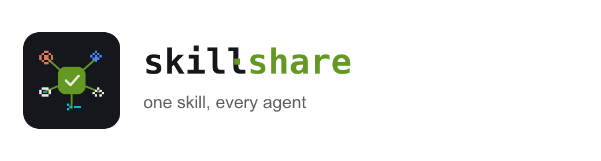

<p align="center">
  
</p>

<h1 align="center">Myco</h1>

<p align="center">
  <em>The mycelial layer for your AI agents — one Mac app that shares skills,
  hands off conversations, and unifies history across every coding agent you run.</em>
</p>

<p align="center">
  <a href="https://github.com/BreetyGreen/multi-agent-skill-sharing/actions/workflows/ci.yml"></a>
  <a href="https://github.com/BreetyGreen/multi-agent-skill-sharing/releases/latest"></a>
  <a href="LICENSE"></a>
  
  
</p>

<p align="center">
  <strong>English</strong> · <a href="README.zh-CN.md">简体中文</a>
</p>

Mushrooms are just the fruit; the real organism is the **mycelium** underground —
a living network that connects an entire forest and lets every tree share
nutrients and signals. Your AI coding agents are that forest: **Claude Code**,
**Codex CLI**, **Cursor**, **Gemini CLI**, **Cline** — each powerful, each
completely walled off from the others.

**Myco is the mycelium.** A single native macOS menu-bar app that quietly
connects your agents so they can share what they know:

- 🟢 **Share skills** — write one `SKILL.md` and fan it out to every agent's
  repo directory, so a skill you teach one tool works in all of them.
- 🔵 **Hand off conversations** — pick up a chat from one agent and continue it
  in another, in a *legitimately new session* (no forged IDs, no fake history).
- 🟣 **Unify history** — read every agent's local transcripts into one neutral,
  searchable, offline timeline you can browse and back up.

All of it from the menu bar. No command line, nothing to configure.

---

## Install

<p align="center">
  <a href="https://github.com/BreetyGreen/multi-agent-skill-sharing/releases/latest">
    
  </a>
</p>

1. Download **`Myco-x.y.z.dmg`** from the
   [latest release](https://github.com/BreetyGreen/multi-agent-skill-sharing/releases/latest).
2. Open the DMG and drag **`Myco.app`** into **Applications**.
3. First launch: because the app is ad-hoc signed (not notarized), macOS
   Gatekeeper will hesitate. **Right-click `Myco.app` → Open → Open** once, and
   you're set.

Myco then lives in your menu bar (the stacked-tiles icon at the top-right).
Click it and everything is one panel away.

> **Requirements:** macOS 13+. That's it — Myco is fully self-contained and uses
> the `python3` that already ships with macOS. Nothing else to install.

---

## What's inside the app

Myco opens to five tabs, each a capability rather than a separate tool:

| Tab | What it does |
|-----|--------------|
| **总览 / Home** | At-a-glance view of which agents are installed on this Mac and how many sessions each holds. |
| **共享 / Share** | Pick a skill, choose which agents to fan it out to (`.claude` / `.codex` / `.agents` / `.cline`), preview, then write. Commit and the whole team is in sync. |
| **接力 / Relay** | Pick a past conversation and package it as paste-ready text to continue in a *different* agent. |
| **历史 / History** | The merged, searchable timeline across all detected agents. |
| **设置 / Settings** | Theme, agent toggles, work directory. |

Everything is **read-only by design**: Myco never writes back into any agent's
storage. Agent databases (Cursor / Antigravity SQLite) are opened in immutable
read-only mode; hand-off and archive operations only ever produce text.

---

## Why this problem exists (the 30-second version)

If you run more than one AI coding tool on the same project, you've hit both walls:

**Skills are siloed.** There is no shared skills directory across agents.
"Install once, everything sees it" is literally false — each product reads
skills from a *different* repo directory:

| Agent | Repo-level dir (travels with Git) | How you invoke it |
|-------|-----------------------------------|-------------------|
| **Claude Code** | `.claude/skills/` | mention the skill by name (some suites add `/slash`) |
| **Codex CLI** | `.agents/skills/` and/or `.codex/skills/` | `$skill-name`, `/skills`, or name it — **not** `/design` |
| **Cursor** | `.cursor/rules/` (rules format) | rules auto-inject; also tolerates `.agents/` |
| **Gemini CLI** | `.agents/skills/` | name it in the prompt |
| **Cline** | `.cline/skills/`, `.clinerules/skills/`, or `.claude/skills/` | name it (experimental toggle) |

**Conversations are siloed too.** Each tool keeps its transcripts in its own
place and format — JSONL here, SQLite blobs there — so context you built up in
one agent is invisible to the next.

Myco knows all of these locations and formats, and bridges them for you. That's
the whole point: you shouldn't have to memorize this table — the app does.

---

## For contributors — the engine under the hood

Myco's UI is a thin SwiftUI shell. The actual work is done by a small,
**pure-Python-stdlib** engine (in [`engine/`](engine/)) that the app calls via
`Process`. You normally never see it — but if you want to hack on Myco, build it
from source, or script these capabilities headlessly, it's all there:

| Engine module | Powers | 
|---------------|--------|
| [`engine/distribute.py`](engine/distribute.py) | skill fan-out (Share tab) |
| [`engine/sync_chats.py`](engine/sync_chats.py) | history aggregation (History tab) |
| [`engine/handoff_chat.py`](engine/handoff_chat.py) | conversation hand-off (Relay tab) |
| [`engine/chatsync/`](engine/chatsync/) | canonical message model + per-agent readers + exporters |

Build the app from source (Command Line Tools only, **no Xcode**):

```bash
cd app
./build.sh              # swift build -c release → assembles self-contained Myco.app
./package_dmg.sh        # (optional) produce a distributable .dmg
open Myco.app
```

Architecture, env-var switches, and source layout: [`app/README.md`](app/README.md).
The portable skill this app ships and distributes lives in
[`skills/multi-agent-skill-sharing/SKILL.md`](skills/multi-agent-skill-sharing/SKILL.md);
its design notes are in [`docs/`](docs/).

---

## Repository layout

```
multi-agent-skill-sharing/          (the Myco project)
├── README.md
├── LICENSE
├── app/                      # Myco — the SwiftUI menu-bar app (the product)
│   ├── Sources/Myco/         #   native UI + PythonBridge
│   ├── build.sh              #   assemble self-contained Myco.app
│   └── package_dmg.sh        #   produce the installable .dmg
├── engine/                   # Myco's internal Python engine (pure stdlib)
│   ├── distribute.py         #   skill fan-out
│   ├── sync_chats.py         #   history aggregation → archive + HTML
│   ├── handoff_chat.py       #   package one chat for a legit hand-off
│   └── chatsync/             #   canonical model + readers + exporters
├── skills/                   # the SKILL.md payload Myco ships & distributes
│   └── multi-agent-skill-sharing/SKILL.md
├── prototype/                # high-fidelity interactive HTML prototype
├── assets/                   # brand: logo, wordmark, palette
└── docs/                     # install notes + design docs
```

---

## Related projects

Myco is about **connecting the agents you already run**, not cataloging skills.
If you're looking for large catalogs of ready-made skills, these are excellent:

| Project | Stars | What it is |
|---------|-------|------------|
| [VoltAgent/awesome-agent-skills](https://github.com/VoltAgent/awesome-agent-skills) | 20k+ | Cross-agent catalog (Claude, Codex, Gemini, Cursor) — the biggest curated list |
| [openai/skills](https://github.com/openai/skills) | 9k+ | OpenAI's official Codex skills directory |
| [vercel-labs/skills](https://github.com/vercel-labs/skills) | 6k+ | Vercel's official skills + CLI tooling |
| [anthropics/skills](https://github.com/anthropics/skills) | — | Anthropic's official skills for Claude Code |
| [agentskills/agentskills](https://github.com/agentskills/agentskills) | 10k+ | The open **SKILL.md** specification / standard |

> Those tell you **what** skills exist. Myco connects the tools you actually run
> so a skill — or a conversation — can move freely between them.

---

## Caveat

Skill-discovery conventions across these tools **change quickly**. The paths
Myco uses were verified **2026-07**. If one doesn't resolve, check the tool's own
docs — and PRs to keep them current are very welcome.

## Contributing

Found a new agent, a changed path, or a better invocation trick? Path updates
are the most valuable contribution here — see [CONTRIBUTING.md](CONTRIBUTING.md)
for what to include (tool version, OS, how you verified) and a quick local check.

## License

MIT — see [LICENSE](LICENSE).
